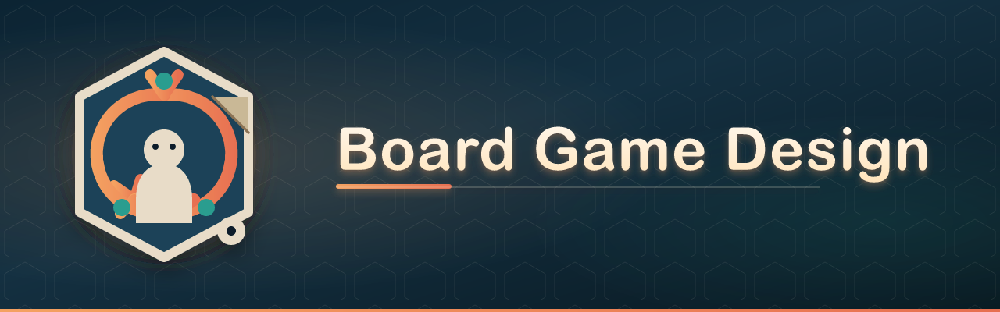
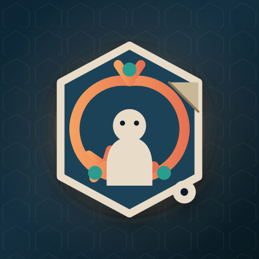

<p align="center">
  <a href="assets/banner.svg">
    
  </a>
</p>

<!-- <p align="center">
  <a href="assets/banner-square.svg">
    
  </a>
  &#160;&#160;&#160;
  <strong><font size="6">Board Game Design</font></strong>
</p> -->

<p align="center">
  <a href="https://agentskills.io/specification"></a>
  <a href="CHANGELOG.md"></a>
  <a href="LICENSE"></a>
  <a href="SKILL.md"></a>
</p>

<!-- <p align="center">
  <a href="assets/logo.svg">
    
  </a>
</p> -->

<p align="center">
  <em>Design tabletop mechanisms, run playtest experiments, and ship paper prototypes — with design state, diagnostics, and evidence-driven iteration.</em>
</p>

<p align="center">
  <a href="#-why">Why</a> ·
  <a href="#-what-you-get">What you get</a> ·
  <a href="#-how-it-works">How it works</a> ·
  <a href="#-install">Install</a> ·
  <a href="#-usage">Usage</a> ·
  <a href="#-brand">Brand</a> ·
  <a href="#-repository-structure">Structure</a> ·
  <a href="#-attribution--scope">Attribution</a> ·
  <a href="#-contributing">Contributing</a>
</p>

---

## 🤔 Why

You sketch a board game. The agent suggests ten mechanisms. Next session it forgets your locked decisions and redesigns from scratch.

The usual workarounds do not help:

- **"Design me a worker placement game"** → generic mechanism dump, no project files
- **"My game feels boring"** → three unrelated rule changes, no diagnosis
- **"Balance these cards"** → numbers without playtest evidence or a falsifiable hypothesis

**Board Game Design turns tabletop iteration into a structured agent workflow** — design state, symptom routing, single-variable experiments, and paper PnP templates your agent maintains across sessions.

Compatible with any host that loads the open [Agent Skills](https://agentskills.io/specification) standard — Cursor, Claude Code, and others read the same `SKILL.md` format.

> Repo-level `README.md` is for humans. Agent instructions live in [`SKILL.md`](SKILL.md) and progressive-disclosure companions — per [Anthropic skill authoring guidance](https://www.anthropic.com/engineering/equipping-agents-for-the-real-world-with-agent-skills).

---

## 📦 What you get

| Path | Role |
|------|------|
| [`SKILL.md`](SKILL.md) | Entrypoint: modes, invariants, indexes, default outputs |
| [`templates/design-state.md`](templates/design-state.md) | Single source of truth for project decisions |
| [`reasoning/`](reasoning/) | Design reasoning, decision matrix, hypothesis rules, experiment priority |
| [`diagnostics/`](diagnostics/) | Symptom guides for 8 core failure modes |
| [`experiments/`](experiments/) | Experiment framework |
| [`kill-criteria.md`](kill-criteria.md) | Continue / Restructure / Pause-or-Kill gate |
| [`lint/`](lint/) | Design lint BG001–BG014 + output checklist |
| [`balance/`](balance/) | Balance model, value budget (links to probability doc) |
| [`theme-and-experience.md`](theme-and-experience.md) | MDA depth, theme-mechanism fit, emotion curve |
| [`tools/`](tools/) | nanDECK and TTS shortest-path guides |
| [`chapters/`](chapters/) | 13 mechanism distillations (*Building Blocks* categories) |
| [`patterns.md`](patterns.md) | High-leverage mechanism patterns |
| [`cheatsheet.md`](cheatsheet.md) | Decision rules + symptom routing + mixed-demand priority |
| [`workflow.md`](workflow.md) | Milestones 0–5 with regression allowed |
| [`playtesting.md`](playtesting.md) | Five playtest frameworks + experiment tie-in |
| [`probability-and-balance.md`](probability-and-balance.md) | Failure modes, McDie, dice intuition |
| [`templates/`](templates/) | Project copy-out files |
| [`templates/examples/micro-scavenger/`](templates/examples/micro-scavenger/) | **Format reference** example game |
| [`eval/benchmark-prompts.md`](eval/benchmark-prompts.md) | Manual skill evaluation cases (Create through Lint) |
| [`eval/README.md`](eval/README.md) | Eval workflow + `eval/fixtures/` for Cases B–F |
| [`CHANGELOG.md`](CHANGELOG.md) | Semver release history |

**Chapter files load on demand** — agents should read the smallest file that answers the question, not all 13 chapters at once.

**Default outputs are project files**, not prose-only advice. Format reference: [`templates/examples/micro-scavenger/`](templates/examples/micro-scavenger/). First playable build: **paper PnP**; TTS / Tabletopia come after the paper loop works.

---

## ⚙️ How it works

### Core loop

```
Intent → Hypothesis → Prototype → Experiment → Evidence → Diagnosis → Decision → (update design-state) → repeat
```

Shorthand: **concept → mechanism skeleton → paper PnP → playtest / balance → (optional) POD or digital**

### Agent modes

Pick one mode per session. Load the smallest file set that mode requires.

| Mode | Trigger | Load first |
|------|---------|------------|
| **Create** | New game from scratch | `workflow.md`, `theme-and-experience.md` |
| **Diagnose** | Symptom (boring, broken, unfair) | `cheatsheet.md` → `diagnostics/*` |
| **Experiment** | Test a specific hypothesis | `experiments/framework.md` |
| **Balance** | Numbers, cards, economy | `balance/README.md` |
| **Prototype** | PnP, rulebook, components | `templates/*`, `tools/*` |

### Hard invariants

1. **Read design-state first** — do not reopen **Locked** decisions without new contradicting evidence
2. **Diagnose before changing** — symptom + causal hypothesis before any rule change
3. **Minimal intervention** — one variable per experiment; no stacked fixes

<details>
<summary><strong>Design principles (click to expand)</strong></summary>

1. **Evidence over opinion** — playtest logs and experiment IDs, not "should feel better"
2. **State preservation** — `design-state.md` survives across chat sessions
3. **Progressive disclosure** — metadata → `SKILL.md` → one companion or chapter
4. **Paper first** — playable index-card prototype before digital or art polish
5. **Synthesized knowledge** — mechanism trade-offs from *Building Blocks*, not raw book dumps

</details>

### What's new in v2.3.1

See [`CHANGELOG.md`](CHANGELOG.md) for full history.

- **Loop Hex branding** — cover + logo in [`assets/`](assets/); README layout refresh (badges, TOC, collapsible prompts)
- **v2.3.0** — experiment prioritization, version lineage, eval fixtures, lint confidence, balance calibration

---

## 📥 Install

### Cursor

Copy or clone into your skills directory. Folder name must match the skill `name`: `board-game-design`.

```text
~/.cursor/skills/board-game-design/          # user-wide
<project>/.cursor/skills/board-game-design/  # project-scoped (preferred when sharing a game repo)
```

```bash
git clone git@github.com:kyle-ip/board-game-design.git ~/.cursor/skills/board-game-design
```

### Claude Code / other Agent Skills hosts

Place the directory where your host discovers skills (often `.claude/skills/board-game-design/`).

Requirements:

- Root [`SKILL.md`](SKILL.md) with YAML `name` + `description`
- Prefer installing from trusted sources; skim bundled files before use

See the open standard: [agentskills.io/specification](https://agentskills.io/specification).

---

## 🚀 Usage

Good prompts give the agent **mode**, **constraints**, and **artifacts** (or paths).

| Include | Why |
|---------|-----|
| **Player count, time, audience** | Stops generic mechanism dumps |
| **Target feel** (tension, bluff, puzzle, …) | Drives MDA-first design |
| **Project path** or `@design-state.md` | Agent reads Locked/Open/Rejected first |
| **Observed symptom + evidence** | Triggers Diagnose mode |
| **One variable to test** | Triggers Experiment mode |
| **Output ask** ("write files to `./my-game/`") | Gets templates, not prose-only |

**Project-scoped tip:** on session 2+, start with *"Read design-state first, then …"*

### When it triggers

- Design or iterate a board / card game
- Choose or balance mechanisms (turn order, auctions, worker placement, cards, …)
- **Diagnose** problems (boring, unfair, snowball, etc.)
- Run **playtest experiments** with falsifiable hypotheses
- **Rank** which experiment to run next
- Evaluate **continue / kill** after 3+ playtests
- Build a print-and-play prototype

<details>
<summary><strong>Create — new game from scratch</strong></summary>

Compare mechanisms, write concept + skeleton + design-state. Ask for **2–4 candidates** before locking rules.

```
Design a 2–4 player, 45-minute medium-weight game about Mars colony logistics.
Target feel: scarcity tension, long-term planning, light direct conflict.
Audience: hobby gamers who know Wingspan but not heavy euros.
Compare worker placement vs action drafting vs open market — recommend one with trade-offs.
Write concept-brief, design-state, and mechanism-skeleton to ./mars-habitat/ using the micro-scavenger example as format reference.
Do not write full rules yet.
```

```
I want a family co-op card game (2–4p, 20 min) with a Cthulhu investigation theme.
Core experience: dread + teamwork, not alpha-player quarterbacking.
Start with theme-and-experience (emotion curve), then suggest mechanisms that fit.
Output files to ./deep-shallows/.
```

| Weak | Strong |
|------|--------|
| "Make me a worker placement game" | Add players, time, feel, audience, and "compare 2–3 chassis before choosing" |
| "Design a card game about pirates" | Add "2p, 15 min, gateway, tension from hand limits" + output directory |

</details>

<details>
<summary><strong>Diagnose — something feels wrong</strong></summary>

Name the **symptom**, give **playtest facts**, ask for **diagnosis + minimal experiment**.

```
We've playtested 4 times (logs in ./orbital-mining/playtests/). Leader is usually decided by round 3; trailing players say they can't catch up.
Read design-state first. Diagnose (snowball vs low agency vs endgame drag), propose one falsifiable hypothesis, and draft EXP-005 — don't change three rules at once.
```

```
After 3 sessions, seat 1 wins 5/7 games at 4 players. Hypothesis: first pick on the worker track is too strong.
Run first-player-advantage diagnostic. Suggest the smallest rule change to test next, with success criteria (e.g. seat 1 win rate < 35% over 10 plays).
```

</details>

<details>
<summary><strong>Experiment — test one change</strong></summary>

Specify **baseline**, **variant**, and **measurable success**.

```
Set up EXP-002: test hand limit 3 → 2 only. Everything else stays v0.6.
Hypothesis: smaller hand increases discard-pile fights without adding AP.
Success: in 4/5 playtests, both players contest discard at least twice; fun ≥ 3.5/5.
Write experiment.md and a blank playtest-log template for the next session.
```

```
Three hypotheses are open in design-state (HYP-001 through HYP-003). Read design-state first, rank them with experiment-priority, update the Experiment Backlog, and draft EXP-004 for rank 1 only.
```

</details>

<details>
<summary><strong>Balance · Prototype · Kill gate · Mechanism lookup</strong></summary>

**Balance**

```
Review CARD-014 through CARD-022 in ./deck-builder/components-sheet.md.
Build balance-spreadsheet rows using value-budget; flag any card where cost vs total estimated value differs by >40%.
State confidence, calibration source, and use scope for each estimate.
```

**Prototype**

```
Turn ./v0.5/mechanism-skeleton.md into a paper PnP: rulebook-draft, components-sheet, pnp-checklist.
2–4p, 30 min, index-card prototype — no art. Run lint/checklist before finishing.
```

**Continue, restructure, or kill**

```
We've completed PT-001 through PT-004. Core loop is learnable but average fun was 2.8/5 twice in a row.
Run kill-criteria.md with me: Continue, Restructure, or Pause/Kill? Cite evidence.
```

**Mechanism lookup**

```
Explain WPL-03 vs soft blocking (bumping) for a 2p game — trade-offs only, no new project files.
```

**Mixed requests** — diagnose/balance before prototype if something is broken.

</details>

<details>
<summary><strong>Prompt checklist (copy before sending)</strong></summary>

- [ ] Players / time / audience / target feel
- [ ] New project vs continuing (`read design-state first`)
- [ ] Desired outputs (which templates, which folder)
- [ ] For iteration: symptom + evidence, not "make it better"
- [ ] For tests: one variable + success metric
- [ ] Optional: `@file` references to your repo artifacts

</details>

---

## 🎨 Brand

**Loop Hex** is the mark on the cover, square banner, and logo — hex tile + evidence loop + meeple.

| Element | Cover | Square banner | Logo |
|---------|-------|---------------|------|
| Hex tile | full detail + paper fold + die pip | same as cover (centered) | hex + loop + meeple only |
| Background | hex grid + glow | same | flat rounded square |
| Text on image | **Board Game Design** only | none | none |

Assets: [`assets/`](assets/) — **PNG** for preview; **SVG** for source files. MIT-licensed with the repo.

---

## 📁 Repository structure

```text
board-game-design/
├── assets/
│   ├── fonts/                              # Fredoka (OFL) for banner typography
│   ├── logo.svg / logo.png                 # Loop Hex icon (minimal, no text)
│   ├── banner.svg / banner.png             # README cover (mark + title)
│   └── banner-square.svg / banner-square.png  # square mark banner (social / avatar)
├── SKILL.md
├── CHANGELOG.md
├── README.md
├── kill-criteria.md
├── theme-and-experience.md
├── workflow.md
├── cheatsheet.md
├── playtesting.md
├── probability-and-balance.md
├── reasoning/
├── diagnostics/
├── experiments/
├── balance/
├── lint/
├── tools/
├── eval/
│   ├── benchmark-prompts.md
│   ├── README.md
│   └── fixtures/
├── chapters/                     # ch01–ch13
├── templates/
│   └── examples/micro-scavenger/
├── references/
└── …
```

---

## ⚖️ Attribution & scope

Mechanism frameworks, codes (e.g. `WPL-01`, `CAR-05`), and trade-off language are **synthesized** from:

> Geoffrey Engelstein & Isaac Shalev, *Building Blocks of Tabletop Game Design*, CRC Press.

Chapter files are **not** a verbatim copy of the book and are **not** a substitute for purchasing it.

- **Single-designer focus** — multi-agent design collaboration is out of scope
- **Default prototype medium** — paper PnP; digital only when requested or after paper works
- **Language** — in Chinese context, prefer each game's official Chinese name when one exists

---

## 🤝 Contributing

- Keep [`SKILL.md`](SKILL.md) lean (<500 lines); put deep material in companions
- Prefer decision rules, state, and experiments over encyclopedic mechanism dumps
- Update [`CHANGELOG.md`](CHANGELOG.md) on each release
- Before minor releases: run Cases A–F per [`eval/README.md`](eval/README.md) (≥5/6 to ship)

---

## License

Code and original skill text in this repository are released under the [MIT License](LICENSE).

## Links

- [Agent Skills specification](https://agentskills.io/specification)
- [Anthropic: Equipping agents with Agent Skills](https://www.anthropic.com/engineering/equipping-agents-for-the-real-world-with-agent-skills)
